# 1.ReactNative基础


## 1.ReactNative MAC开发环境搭建

ReactNative 中文官网：http://reactnative.cn/docs/0.45/getting-started.html

mac下的安装的视频教程：https://ke.qq.com/course/197101

#### 1.Homebrew

[Homebrew](http://brew.sh/), Mac系统的包管理器，用于安装NodeJS和一些其他必需的工具软件。

```
#把下面这个命令考到终端下执行
/usr/bin/ruby -e "$(curl -fsSL https://raw.githubusercontent.com/Homebrew/install/master/install)"
```

译注：在Max OS X 10.11（El Capitan)版本中，homebrew在安装软件时可能会碰到`/usr/local`目录不可写的权限问题。可以使用下面的命令修复： 

```
#把下面这个命令考到终端下执行
sudo chown -R `whoami` /usr/local
```

#### 2.Node

使用Homebrew来安装[Node.js](https://nodejs.org/).

> React Native目前需要NodeJS 5.0或更高版本。本文发布时Homebrew默认安装的是最新版本，一般都满足要求。 

```
#把下面这个命令考到终端下执行
brew install node
```

安装完node后建议设置npm镜像以加速后面的过程（或使用科学上网工具）。注意：不要使用cnpm！cnpm安装的模块路径比较奇怪，packager不能正常识别！

```
#把下面这个命令考到终端下执行
npm config set registry https://registry.npm.taobao.org --global
npm config set disturl https://npm.taobao.org/dist --global
```

#### 3.Yarn、React Native的命令行工具（react-native-cli）

[Yarn](http://yarnpkg.com/)是Facebook提供的替代npm的工具，可以加速node模块的下载。React Native的命令行工具用于执行创建、初始化、更新项目、运行打包服务（packager）等任务。

```
#把下面这个命令考到终端下执行
npm install -g yarn react-native-cli
```

安装完yarn后同理也要设置镜像源：

```
#把下面这个命令考到终端下执行
yarn config set registry https://registry.npm.taobao.org --global
yarn config set disturl https://npm.taobao.org/dist --global
```

如果你看到`EACCES: permission denied`这样的权限报错，那么请参照上文的homebrew译注，修复`/usr/local`目录的所有权： 

```
#把下面这个命令考到终端下执行
sudo chown -R `whoami` /usr/local
```

#### 4.Xcode

React Native目前需要[Xcode](https://developer.apple.com/xcode/downloads/) 8.0 或更高版本。你可以通过App Store或是到[Apple开发者官网](https://developer.apple.com/xcode/downloads/)上下载。这一步骤会同时安装Xcode IDE和Xcode的命令行工具。

> 虽然一般来说命令行工具都是默认安装了，但你最好还是启动Xcode，并在`Xcode | Preferences | Locations`菜单中检查一下是否装有某个版本的`Command Line Tools`。Xcode的命令行工具中也包含一些必须的工具，比如`git`等。

#### 5.Android Studio

React Native目前需要[Android Studio](http://developer.android.com/sdk/index.html)2.0或更高版本。

> Android Studio需要Java Development Kit [JDK] 1.8或更高版本。你可以在命令行中输入 `javac -version`来查看你当前安装的JDK版本。如果版本不合要求，则可以到 [官网](http://www.oracle.com/technetwork/java/javase/downloads/jdk8-downloads-2133151.html)上下载。


JDK安装教程：http://blog.csdn.net/qw963895582/article/details/49299433


Android Studio包含了运行和测试React Native应用所需的Android SDK和模拟器。

> 除非特别注明，请不要改动安装过程中的选项。比如Android Studio默认安装了 `Android Support Repository`，而这也是React Native必须的（否则在react-native run-android时会报appcompat-v7包找不到的错误）。

安装过程中有一些需要改动的选项：

- 选择`Custom`选项：


- 勾选`Performance`和`Android Virtual Device`


- 安装完成后，在Android Studio的启动欢迎界面中选择`Configure | SDK Manager`。


- 在`SDK Platforms`窗口中，选择`Show Package Details`，然后在`Android 6.0 (Marshmallow)`中勾选`Google APIs`、`Android SDK Platform 23`、`Intel x86 Atom System Image`、`Intel x86 Atom_64 System Image`以及`Google APIs Intel x86 Atom_64 System Image`。


- 在`SDK Tools`窗口中，选择`Show Package Details`，然后在`Android SDK Build Tools`中勾选`Android SDK Build-Tools 23.0.1`（必须是这个版本）。然后还要勾选最底部的`Android Support Repository`.


**ANDROID_HOME环境变量**

确保`ANDROID_HOME`环境变量正确地指向了你安装的Android SDK的路径。具体的做法是把下面的命令加入到`~/.bash_profile`文件中：(**译注**：~表示用户目录，即`/Users/你的用户名/`，而小数点开头的文件在Finder中是隐藏的，并且这个文件有可能并不存在。请在终端下使用`vi ~/.bash_profile`命令创建或编辑。如不熟悉vi操作，请点击[这里](http://www.eepw.com.cn/article/48018.htm)学习） 

```
# 如果你不是通过Android Studio安装的sdk，则其路径可能不同，请自行确定清楚。
export ANDROID_HOME=~/Library/Android/sdk
```

然后使用下列命令使其立即生效（否则重启后才生效）： 

```
source ~/.bash_profile
```

可以使用`echo $ANDROID_HOME`检查此变量是否已正确设置。

#### 6.Watchman （推荐安装的工具）

[Watchman](https://facebook.github.io/watchman/docs/install.html)是由Facebook提供的监视文件系统变更的工具。安装此工具可以提高开发时的性能（packager可以快速捕捉文件的变化从而实现实时刷新）。

```
#把下面这个命令考到终端下执行
brew install watchman
```

#### 7.测试安装（建议先启动模拟器）

```
# run android 把下面这个命令考到终端下执行
react-native init AwesomeProject
cd AwesomeProject
react-native run-android

# run ios 把下面这个命令考到终端下执
react-native init AwesomeProject
cd AwesomeProject
react-native run-ios
```


## 3.运行HelloWrold

### **1.创建RN项目**

```
1)进入你希望创建项目的目录后，输入react-native init HelloWrold，等待一段时间（较慢）
```

例如：

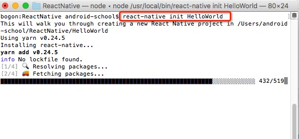

### **2.创建完成**


### 3.**查看项目结构**

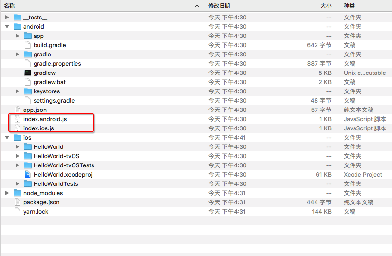

### **4.运行项目项目**

```
1)在命令行中进入HelloWrold项目根目录，输入react-native run-ios，等待一段时间
```

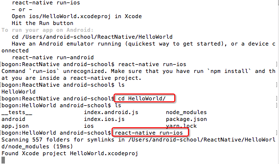


运行在ios上成功（最好先启动模拟器）

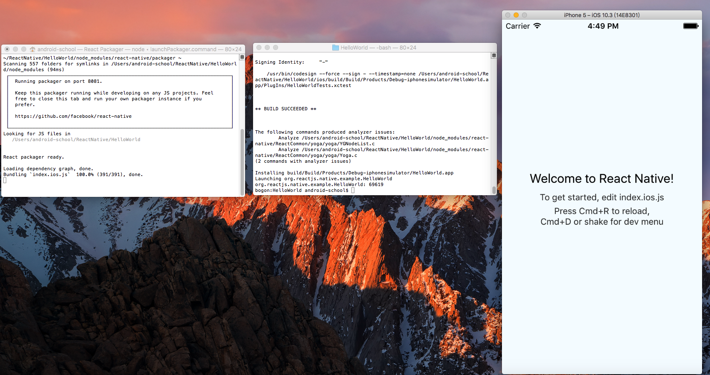

运行android上成功（先要启动模拟器）

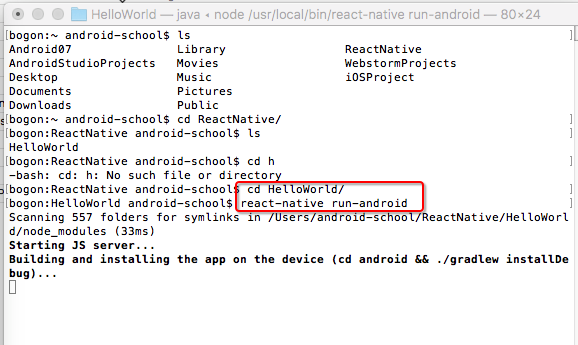


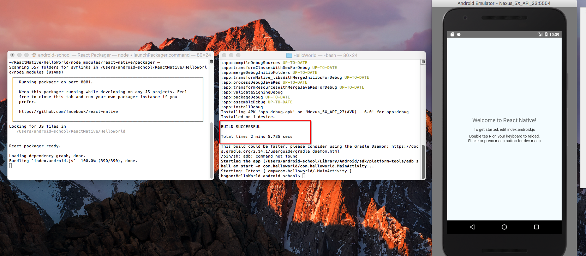

### **5.手动启动ios模拟器**

1.在webstrom中选中reveal in Finder

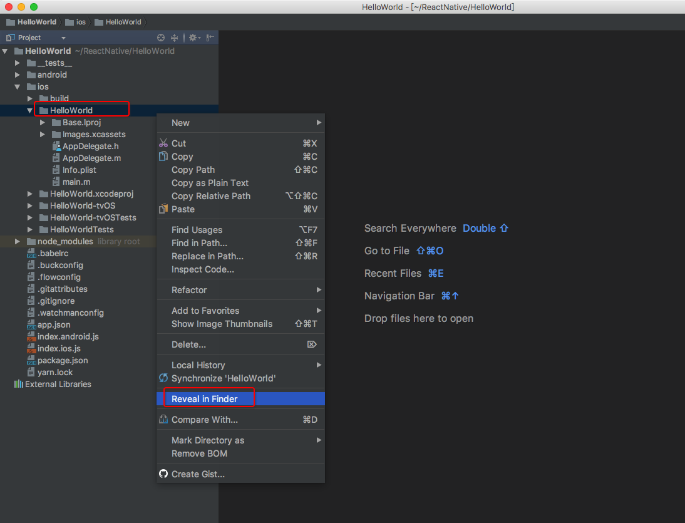


2.双击打开HelloWorld.xcodeproj


3.xcode打开ios项目介绍

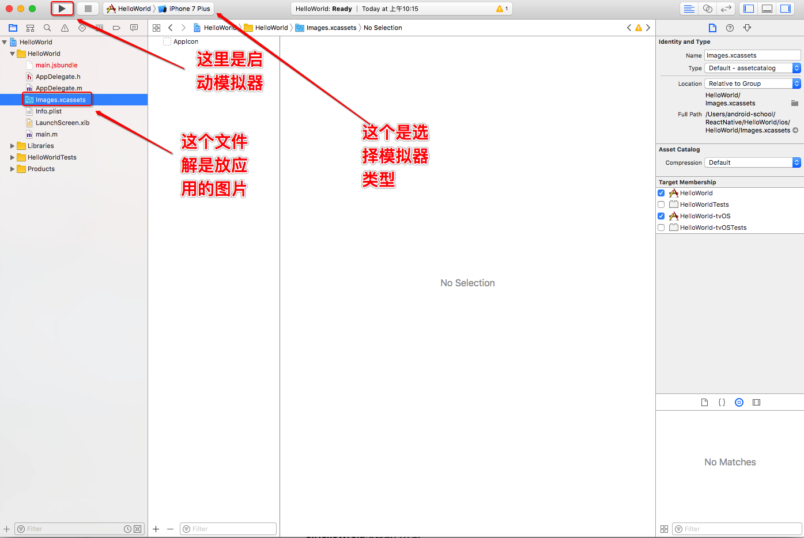

4.选好模拟器即可启动

cmd+1  cmd+2       改变模拟器大小

cmd + r   cmd +d    刷新模拟器

shift+cmd+h   退出app


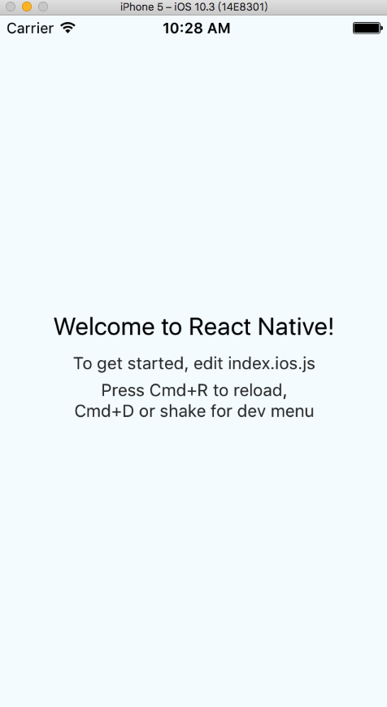

### **6.手动启动android模拟器**

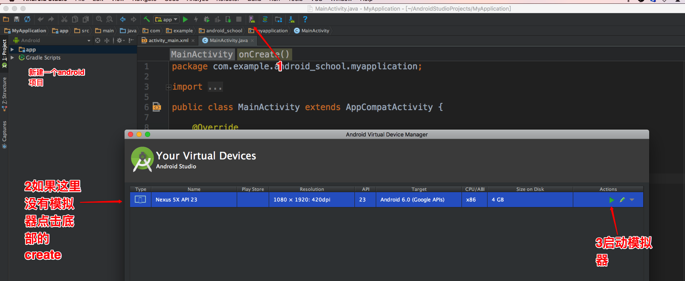

启动后  


## 4.管理RN版本库

   在开发中，会经常的去控制React Native的版本库，得以适配各种条件下的开发，那该如何查看、控制ReactNative的版本呢？

### **1 查看本地的React Native的版本**

  进入项目的根目录，在iOS命令行输入

   react-native --version

  命令行效果

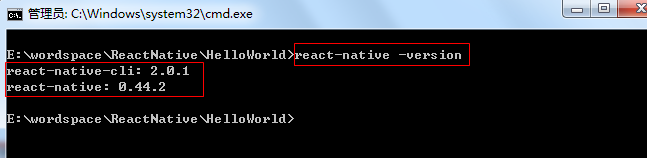

项目中查看react-native版本

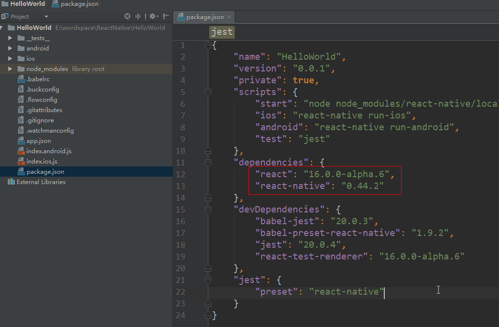


### **2 更新本地的react-native-cli版本**

    进入项目的根目录，在iOS命令行输入

```
 npm update -g react-native-cli
```

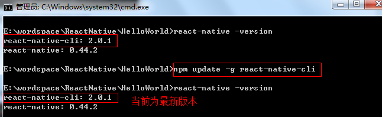

### **3 查询react-native的npm包最新版本**

NPM的全称是Node Package Manager ，是一个NodeJS包管理和分发工具，已经成为了非官方的发布Node模块（包）的标准。

    进入项目的根目录，在iOS命令行查询npm包最新版本

```
npm info react-native
```

   执行命令

    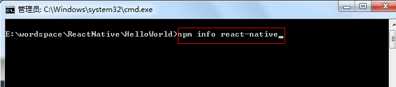

   **如果是iOS的命令行即可直接查看效果**

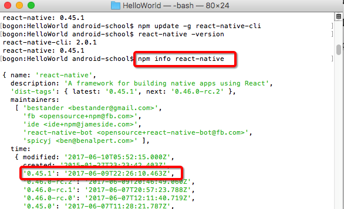

   **如果是window电脑要把命令行的信息到导出一个文件，可执行下面的命令**

```
npm info react-native >> D:\logcat.txt
```

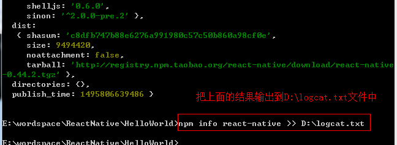

  查看当前最新版本

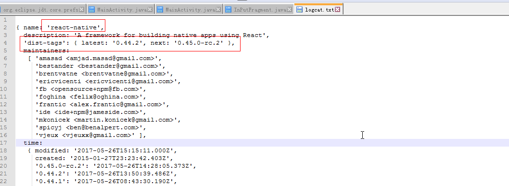


### **4 升级或者降级npm包的版本**

在项目的根目录执行下面的命令：

```
npm install --save react-native@0.41.1       (版本号)
```

译注：从0.24版本开始，react-native还需要额外安装react模块，且对react的版本有严格要求，高于或低于某个范围都不可以。本文无法在这里列出所有react native和对应的react模块版本要求，只能提醒读者先尝试执行npm install，然后注意观察安装过程中的报错信息，例如`require react@某.某.某版本, but none was installed`，然后根据这样的提示，执行`npm install react@^15.4.2 --save`。

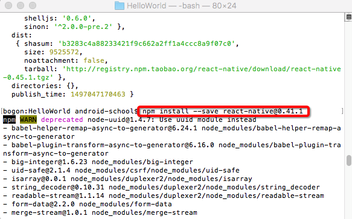


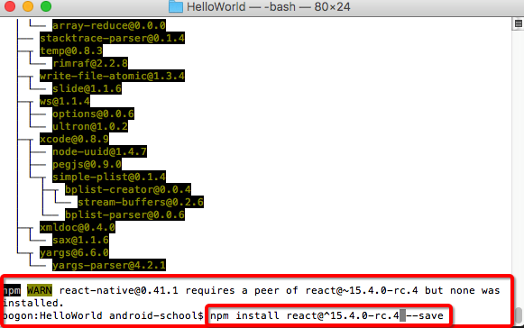

升级react-native的npm版本后，打开该项目中的package.json文件，找到dependencies标签里边我们把react-native的版本修改成最新版本

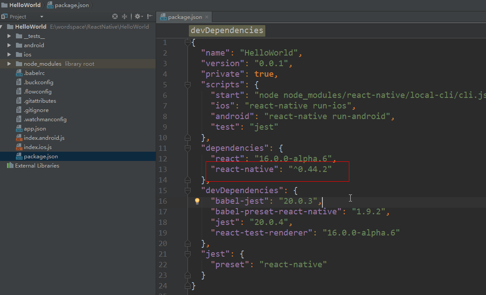

接下来就是执行如下代码进行安装(注意请命令行切换到项目主文件夹):-这个安装过程还是需要花点时间的

```
npm install
```

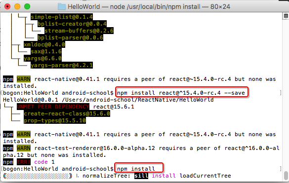


### **5 更新项目templates文件（可选）**

       新的npm包会包含更新在运行react-native init命令生成的一些动态文件，例如init创建项目的时候会生成iOS和Android的子项目，我们可以通过以下的命令进行获取最新的代码

     命令行执行，如果有提示按yes

```
react-native upgrade
```

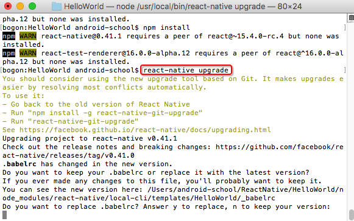

## 5.WebStom设置RN代码提示

安装[ReactNative-LiveTemplate-master](https://github.com/virtoolswebplayer/ReactNative-LiveTemplate)插件,window的用户建议使用第一种方式安装

将`ReactNative.xml`复制到 `~/Library/Preferences/WebStorm2016.3/templates`

### 第一步

通过 open ~/Library/Preferences/   指令可以打开隐藏的文件夹

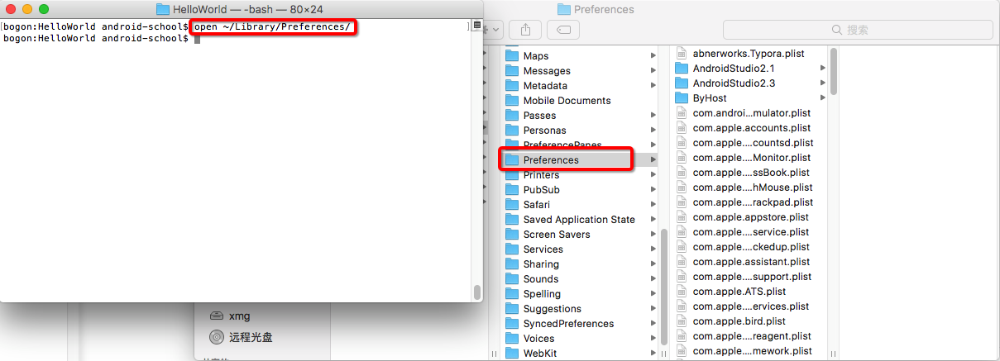


### 第二步：

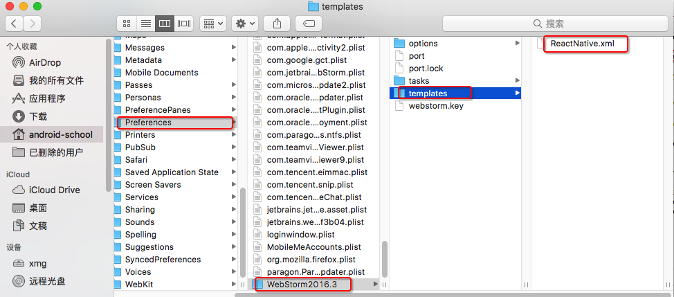

### 第三步

注意：重新启动webstrom软件

# 2.Image组件

## 1.Image组件的基本用法

### 1 从当前项目中加载图片

**记住头部要引入Image组件**

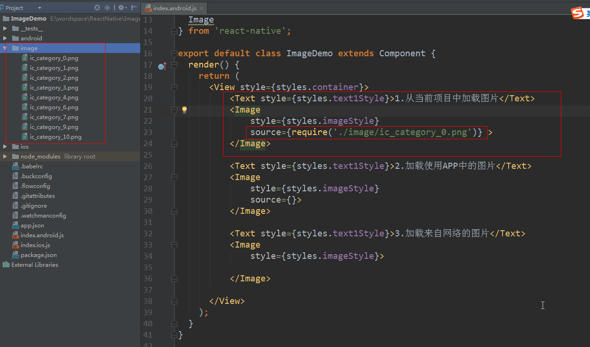

该图片资源文件的查找和JS模块相似，该会根据填写的图片路径相对于当前的js文件路径进行搜索。

**注意:这边使用Image组件，require中的图片名称必须为一个静态的字符串信息。不能在require中进行拼接**

此外，**React Naive的Packager会根据平台选择相应的文件**，例如:my_icon.ios.png和my_icon.android.png两个文件(命名方式android或者ios)，会分别根据android或者ios平台选择相应的文件。

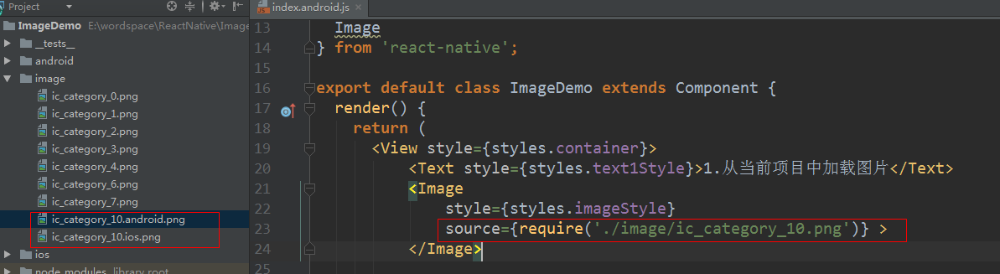


执行的效果：

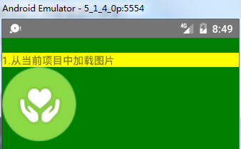

### 2 加载使用APP中的图片

使用已经打包在APP中的图片资源(例如:**xcode asset**文件夹以及Android **drawable**文件夹)

**注意：图片没有扩展名**

android

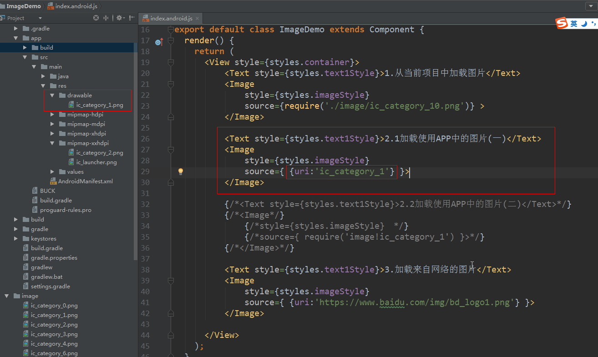

ios

第一步：用xcode打开项目


第二步：把图片放进项目

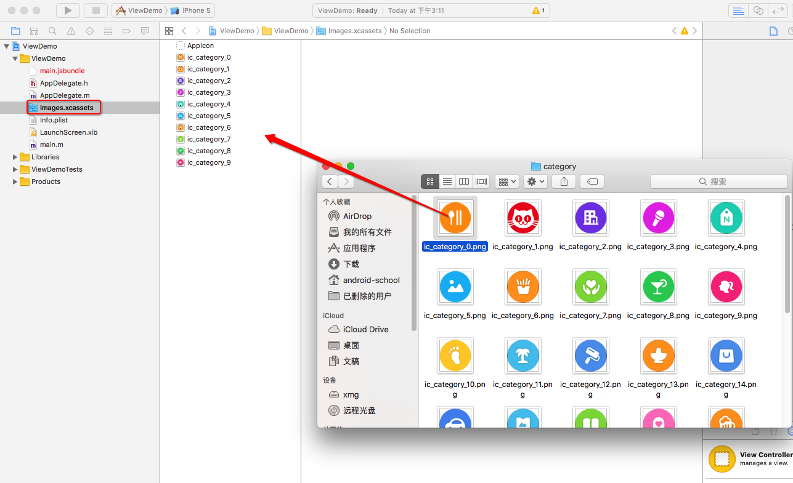


第三步：查看项目

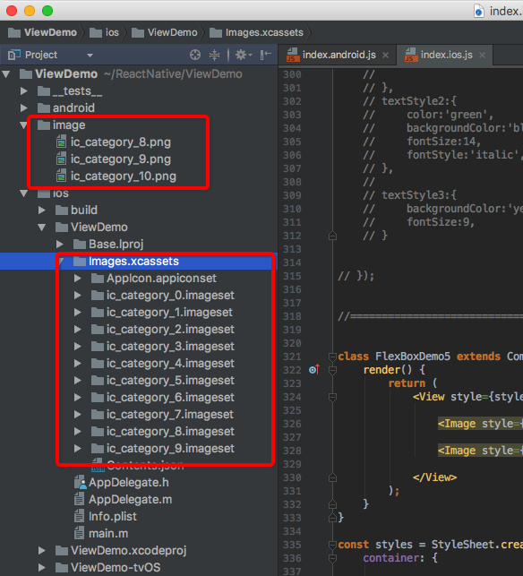

不过如果要显示效果：希望大家做如下修改，因为现在android项目采用gradle，现在不会默认生成drawable文件夹中了，所以大家如果要演示效果，需要在res下面新建一个drawable文件夹，然后放一个图片进入，接着在重新打包运行即可(这边测试的是把ic_launcher.png图片放入到res/drawable文件夹中)。不过经测试drawable-hdpi这类的不同分辨率格式文件夹也可以运行。

执行的效果：

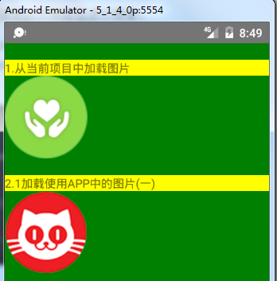

### 3 加载来自网络的图片

       客户端的很多图片资源基本上都是实时通过网络进行获取的，写法和上面的加载本地资源图片的方式不太一样，**这边一定需要指定图片的尺寸大小**

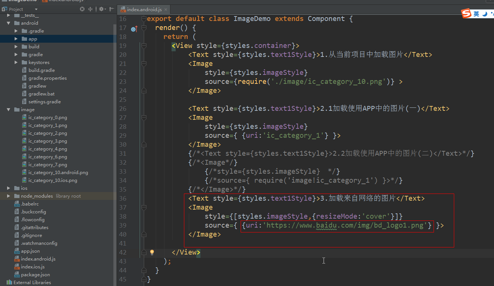

上面用到了resizeMode这样一个属性，那么这个属性的作用相当于OC中设置**图片的缩放模式**。

 **resizeMode.cover**：（默认）图片居中显示，没有被拉伸，超出部分被截断；

resizeMode.contain：容器完全容纳图片，图片等比例进拉伸；

resizeMode.stretch： 图片被拉伸适应容器大小，有可能会发生变形。


**注意：ios如果加载网络http协议的图片失败**

iOS9之后，默认Https请求，如需支持Http，修改info.plist文件添加键值对就好了,如下图

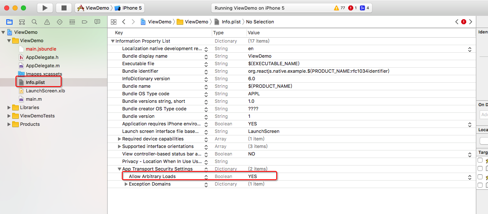

### 4 设置图片为背景

    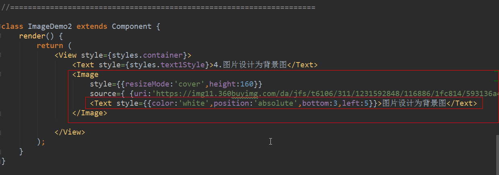

  运行的效果：


