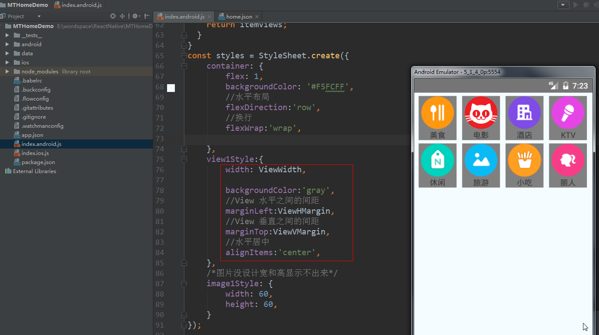

# 1.ReactNative基础

## 1.RN的介绍

****

尽管在移动开发中，原生App的开发成本很高，但现阶段基于原生开发仍然是必须的，因为Web的用户体验仍无法超越Native，主要体现在：

- Native的原生控件有更好的体验；
- Native有更好的手势识别；
- Native有更合适的线程模型，尽管Web Worker可以解决一部分问题，但如图像解码、文本渲染仍无法多线程渲染，这影响了Web的流畅性。

> **思考？**
>
> 怎么做才能拥有Native的体验和性能，又能够高效率开发、跨平台开发？

**一、答案**

      React Native于F8大会开源,在短短不到一年的时间里,它成为手机端必不可少的开发模式之一。 它充分利用了Facebook现有的业务轮子, 其核心设计理念：**既拥有Native的用户体验、又保留React的开发效率**。

      目前，React Native基本完成了对多端的支持，实现了真正意义上的面向配置开发: 开发者可以灵活的使用HTML和CSS布局,使用React语法构建组件,实现：**Android, iOS 两端代码的复用**。

****

       此外，使用流畅度和原生的保持在同一层次,这不是我们梦寐以求的开发模式吗?让我们从无到有开启新的学习篇章吧!

**二、什么是React Native？**

**（一）时下移动互联网主流技术**

           BAT等一线互联网公司的插件化，热修改等技术

           阿里的Weex、尤小右的Vue.js等

           React Native技术

**（二）React Native介绍**

          Facebook于2015年9月15日发布**React Native;**

          广大开发者可以使用JavaScript和React开发跨平台移动应用;

          React Native特点：

          1）使用 Virtual DOM；

​		1)通过JS对象模拟原生DOM，加上DOM Diff 极大提升了**DOM操作的性能**

 		2)浏览器中，Virtual DOM最终编译成了DOM，但是在 iOS中，Virtual DOM却完全可以编译成                     		 

​		  oc的组件，甚至在安卓、windows、mac osx 中都完全**可以编译成对应的UI组件**

          2）提供了**响应式**（Reactive）和**组件化**（Composable）的视图组件；

​		例如：响应式开发的页面会根据用户行为以及设备环境(系统平台、屏幕尺寸、屏幕定向等)进行	

​                           相应的响应和调整 ,  响应式的页面有能力去自动响应用户的设备环境。

​		例如：每一个组件都有自己清晰的职责，完整的功能，较低的耦合便于单元测试和重复利用；

​			   低耦合性，通俗点说，代码独立不会和项目中的其他代码发生冲突等。

          3）将注意力集中保持在核心库，伴随于此，有配套的**路由**和负责处理全局状态管理的库。

 （**三）React Native的优势**

      1）跨平台开发

        运用React Native，我们可以使用同一份业务逻辑核心代码来创建原生应用运行在Web端，Android端和iOS端；

     2）追求极致的用户体验：实时热部署  

   3）learn once ,  write everywhere （最具魅力）

        React Native不强求一份原生代码支持多个平台，所以不是“Write once, run anywhere”（Java），而是“Learn once, write anywhere”。

        

**（四）React Native开发注意事项**

      1）目前react native在iOS上仅支持**ios7**以上，Android仅支持**Android4.1**以上版本；

       github地址:  https://github.com/facebook/react-native 

       官网文档: http://facebook.github.io/react-native/docs/getting-started.html

      2） 由于React Native的版本更新速度很快，如果没有深厚的JavaScript基础，建议选择：

          **a、功能适中，交互一般，不需要特别多的系统原生支持；**

​	  **b、对于部分复杂的应用，可以考虑原生+React Native混合开发**


## 2.ReactNative开发环境搭建

ReactNative 开发环境搭建：http://reactnative.cn/docs/0.28/getting-started.html#content

ReactNative 视频教程：https://ke.qq.com/course/197101

### 1.[安装jdk1.8](http://www.oracle.com/technetwork/java/javase/downloads/jdk8-downloads-2133151.html)

参考：https://jingyan.baidu.com/article/6dad5075d1dc40a123e36ea3.html

### 2.[安装android studio](https://developer.android.com/studio/index.html)

打开Android SDK Manager。

选中以下项目，以下的是必需安装：

- Android SDK Build-tools version 23.0.1
- Android Support Repository
- Android 6.0 (API 23)

### 3.[配置sdk路径]()

- 添加环境变量ANDROID_HOME ：android sdk根路径
- 修改path路径:%ANDROID_HOME%\tools;%ANDROID_HOME%\platform-tools


**以上1-3步骤是搭建android开发环境**, 因为ReactNative的开发环境是依赖Android开发环境


### 4.[安装Python2](https://www.python.org/downloads/)

将python加入环境变量，然后可以通过 `python` 的命令来测试python是否安装成功

参考：https://jingyan.baidu.com/article/c910274be14d64cd361d2dd8.html

### 5.[安装node](https://nodejs.org/en/download/)

```
ReactNative是基于js的，Node.js轻量级的Web服务器，想要是React Native跑起来需要安装node， 如果没有安装node.js，先去官网安装node.js,最好是4.1以上版本

可以通过node -v的命令来测试NodeJS是否安装成功

//安装完node后建议设置npm镜像以加速后面的过程（或使用科学上网工具）。
npm config set registry https://registry.npm.taobao.org --global
npm config set disturl https://npm.taobao.org/dist --global
```

### 6.[安装git(可选)](https://git-scm.com/download/win)

```
安装React-native可能需要用到Git，如果没有配置git，需要先下载对应的客户端，
然后将git加入path环境变量
```

### 7.安装yarn 和 react-native命令行工具[react-native-cli]()

第一种(推荐)：

```
npm install -g yarn react-native-cli

//安装完yarn后同理也要设置镜像源：
yarn config set registry https://registry.npm.taobao.org --global
yarn config set disturl https://npm.taobao.org/dist --global
```

第二种：

```
git配置完成后可以clone React-native-cli了，建议大家到将react-native-cli克隆到某个盘，不要在c盘直接clone

1)在命令行中进入你希望RN安装的目录

2)输入git clone https://github.com/facebook/react-native.git，等待下载

3)clone成功后,找到react-native-cli目录，输入npm install -g

4)安装好之后，可以命令行下就有react-native命令了
```

参考：http://blog.csdn.net/u012987546/article/details/52210530


## 3.运行HelloWrold

### 1.创建RN项目

```
1)进入你希望创建项目的目录后，输入react-native init HelloWrold，等待一段时间（较慢）
```

例如：


### 2.创建完成


### 3.查看项目结构


### 4.运行项目package服务（不要关闭）

```
1)在命令行中进入HelloWrold项目根目录，输入react-native start，等待一段时间
```


### 5.运行项目（先启动手机模拟器）

```
刚刚运行package的命令行不要关闭，重新启动一个新的命令行，
进入HelloWrold项目目录，输入react-native run-android，等待运行(如果是第一次运行，首先会下载gradle，时间较长)
```


### 6.运行成功


查看效果


4.HelloWrold项目结构介绍


## 4.管理RN版本库

   在开发中，会经常的去控制React Native的版本库，得以适配各种条件下的开发，那该如何查看、控制ReactNative的版本呢？

### **1 查看本地的React Native的版本**

  命令行输入

```
 react-native --version
```

  命令行效果


项目中查看react-native版本


### **2 更新本地的react-native-cli的版本**

    命令行输入

```
npm update -g react-native-cli
```


### **3 查询react-native的npm包最新版本**

NPM的全称是Node Package Manager ，是一个NodeJS包管理和分发工具，已经成为了非官方的发布Node模块（包）的标准。

    命令行查询npm包最新版本

```
npm info react-native
```

   执行命令

    

   查看效果

```
npm info react-native >> D:\logcat.txt
```


查看当前最新版本


### **4 升级或者降级npm包的版本**

```
npm install --save react-native@0.41.1       (版本号)
```

译注：从0.24版本开始，react-native还需要额外安装react模块，且对react的版本有严格要求，高于或低于某个范围都不可以。本文无法在这里列出所有react native和对应的react模块版本要求，只能提醒读者先尝试执行npm install，然后注意观察安装过程中的报错信息，例如`require react@某.某.某版本, but none was installed`，然后根据这样的提示，执行`npm install react@^15.4.2 --save`。


升级react-native的npm版本后，打开该项目中的package.json文件，找到dependencies标签里边我们把react-native的版本修改成最新版本


接下来就是执行如下代码进行安装(注意请命令行切换到项目主文件夹):-这个安装过程还是需要花点时间的

```
npm install
```


### **5 更新项目templates文件（可选）**

       新的npm包会包含更新在运行react-native init命令生成的一些动态文件，例如init创建项目的时候会生成iOS和Android的子项目，我们可以通过以下的命令进行获取最新的代码

     命令行执行，如果有提示按yes

```
react-native upgrade
```


## 5.WebStom设置RN代码提示

安装[ReactNative-LiveTemplate-master](https://github.com/virtoolswebplayer/ReactNative-LiveTemplate)插件,window的用户建议使用第一种方式安装


# 2.View组件

## 1.JSX的概念

    React的核心机制之一就是虚拟DOM：可以在内存中创建的虚拟DOM元素。React利用虚拟DOM来减少对实际DOM的操作从而提升性能。传统的创建方式

       

      但这样的代码可读性并不好，于是React发明了JSX，利用我们熟悉的HTML语法来创建虚拟DOM： 

    

       在实际开发中，JSX在产品打包阶段都已经编译成纯JavaScript，JSX的语法不会带来任何性能影响。因此，JSX本身并不是什么高深的技术，可以说只是一个比较高级但很直观的语法糖。   

## 2.View常见的属性

React Native组件View，其作用等同于iOS中的UIView, Android中的android.view，或是网页中的<div>标签，它是所有组件的父组件。

> ###### **Flexbox** 弹性布局


> ###### **Transforms** 动画属性


> ###### **backfaceVisibility** enum('visible', 'hidden')    定义界面翻转的时候是否可见


> ###### backgroundColor color


> ###### borderBottomColor color


> ###### borderBottomLeftRadius number


> ###### borderBottomRightRadius number


> ###### borderBottomWidth number


> ###### borderColor color


> ###### borderLeftColor color


> ###### borderLeftWidth number


> ###### borderRadius number


> ###### borderRightColor color


> ###### borderRightWidth number


> ###### borderStyle enum('solid', 'dotted', 'dashed')


> ###### borderTopColor color


> ###### borderTopLeftRadius number


> ###### borderTopRightRadius number


> ###### borderTopWidth number


> ###### borderWidth number


> ###### **opacity** number 设置透明度，取值从0-1；


> ###### **overflow** enum('visible', 'hidden')  设置内容超出容器部分是显示还是隐藏；


> ###### **elevation** number 高度   设置Z轴，可产生立体效果。


## 3.View组件运用

在index.android.js中的render函数中写如下布局：

**注意：样式常见的3中书写方法**


 在图中的render函数中，我们返回了一个顶层的View，然后View中包含着3个子Text.

运行结果如下：


在React Native开发中，更加推荐我们采用**StyleSheet**来进行组件的布局，这样的话，代码在结构上会更加的清晰、也有利于后期维护。

下面看StyleSheet的实现:


# 3.FlexBox布局

## 1.什么FlexBox布局？

 [弹性盒模型]()（The Flexible Box Module）,又叫Flexbox，意为“[弹性布局]()”，旨在通过弹性的方式来对齐和分布容器中内容的空间，使其能适应不同屏幕，为盒装模型提供最大的灵活性。

Flex布局主要思想是：让容器有能力让其子项目能够改变其宽度、高度（甚至是顺序），以最佳方式填充可用空间；

## 2.常见的布局模型

**大部分情况下是处理图中FlexItem在FlexContainer中的位置和尺寸关系**


# 4.Flexbox在开发中的应用场景

## 1.Flexbox在布局中能够解决什么问题？

      浮动布局

     各种机型屏幕的适配

     水平和垂直居中

     自动分配宽度

     ......

## 2.Flex布局的思想

**主轴**

**侧轴（交叉轴）**


容器默认存在两根轴：**水平的主轴（main axis）**和**垂直的交叉轴（cross axis）**。主轴的开始位置（与边框的交叉点）叫做main start，结束位置叫做main end；交叉轴的开始位置叫做cross start，结束位置叫做cross end。

项目默认沿主轴排列，单个项目占据的主轴空间叫做main size，占据的交叉轴空间叫做cross size。

## 3.父容器排列方式的不同，主轴和侧轴方向也有所变化


**结论：主轴的方向  与  父容器中的排列方向  一致**

# 5.Flexbox的常用属性

## 1.容器属性

### 1.flexDirection

`row | row-reverse | column | column-reverse`

  **该属性：规定了主轴的方向（父容器中的排列方向）**。

     row：主轴为水平方向，起点在左端。

     row-reverse：主轴为水平方向，起点在右端。

    column(默认值)：主轴为垂直方向，起点在上沿。

    column-reverse：主轴为垂直方向，起点在下沿。

    column-reverse：主轴为垂直方向，起点在下沿。

    

案例：


效果：


将上面的flexDirection的属性修改成：row后，效果为：


### 2.justifyContent

**`flex-start | flex-end | center | space-between | space-around`**

**规定：子item在主轴方向的对齐方式**

      flex-start(默认值)：伸缩项目向一行的起始位置靠齐。

      flex-end：伸缩项目向一行的结束位置靠齐。

      center：伸缩项目向一行的中间位置靠齐。

      space-between：两端对齐，项目之间的间隔都相等。

      space-around：伸缩项目会平均地分布在行里，两端保留一半的空间。

  **下图灰色为背景,主轴方向为水平，侧轴方向为垂直**：


案例：


运行效果：


### 3.alignItems

`flex-start | flex-end | center | baseline | stretch`

**规定：子item在侧轴方向的对齐方式**

      flex-start：交叉轴的起点对齐。

      flex-end：交叉轴的终点对齐 。

      center：交叉轴的中点对齐。

      baseline：项目的第一行文字的基线对齐。

      stretch（默认值）：如果项目未设置高度或设为auto，将占满整个容器的高度。

**下图灰色为背景，主轴方向是水平，侧轴方向是垂直**

   


### 4.flexWrap ..   

**`nowrap | wrap | wrap-reverse`**

默认情况下，项目都排在一条线（又称"轴线"）上。flex-wrap属性定义，如果一条轴线排不下，如何换行。


nowrap(默认值)：不换行。


wrap：换行，第一行在上方。


wrap-reverse：换行，第一行在下方。（和wrap相反）


案例：


运行效果：


## 2.元素属性

### 1.flex

flex是 “flex-grow”、“flex-shrink”和“flex-basis”[三个属性的缩写](http://www.runoob.com/w3cnote/flex-grammar.html) , 参数一：定义项目的放大比例；参数二：定义了项目的缩小比例；参数三：定义了在分配多余空间之前，项目占据的主轴空间。其中第二个和第三个参数（flex-shrink、flex-basis）是可选参数。

flex默认值为“0  1  auto ”。

  

案例：


运行效果：


# 6.在React Native中使用Flexbox

## 1.获取当前屏幕的宽度、高度、分辨率3

获取当前屏幕的宽度、高度、分辨率


把宽高显示的界面


最终效果


## 2.绝对定位和相对定位4

**1.绝对定位**

直接在**子组件中指定绝对定位**

**绝对定位是相对于父亲布局**


添加样式


执行效果


**2.相对定位**

直接在**子组件中指定相对定位**

**相对定位是相对于自身**


布局样式


执行效果：


## 3.水平、垂直居中5

代码：


样式：


执行效果：


# 7.Image组件

## 1.Image组件的基本用法

### 1 从当前项目中加载图片

**记住头部要引入Image组件**


该图片资源文件的查找和JS模块相似，该会根据填写的图片路径相对于当前的js文件路径进行搜索。

**注意:这边使用Image组件，require中的图片名称必须为一个静态的字符串信息。不能在require中进行拼接**

http://reactnative.cn/docs/0.46/images.html#content

此外，**React Naive的Packager会根据平台选择相应的文件**，例如:my_icon.ios.png和my_icon.android.png两个文件(命名方式android或者ios)，会分别根据android或者ios平台选择相应的文件。


执行的效果：


### 2 加载使用APP中的图片

使用已经打包在APP中的图片资源(例如:**xcode asset**文件夹以及Android **drawable**文件夹)

**注意：图片没有扩展名**


    

不过如果要显示效果：希望大家做如下修改，因为现在android项目采用gradle，现在不会默认生成drawable文件夹中了，所以大家如果要演示效果，需要在res下面新建一个drawable文件夹，然后放一个图片进入，接着在重新打包运行即可(这边测试的是把ic_launcher.png图片放入到res/drawable文件夹中)。不过经测试drawable-hdpi这类的不同分辨率格式文件夹也可以运行。

执行的效果：


### 3 加载来自网络的图片

       客户端的很多图片资源基本上都是实时通过网络进行获取的，写法和上面的加载本地资源图片的方式不太一样，**这边一定需要指定图片的尺寸大小**


上面用到了resizeMode这样一个属性，那么这个属性的作用相当于OC中设置**图片的缩放模式**。

 **resizeMode.cover**：（默认）图片居中显示，没有被拉伸，超出部分被截断；

resizeMode.contain：容器完全容纳图片，图片等比例进拉伸；

resizeMode.stretch： 图片被拉伸适应容器大小，有可能会发生变形。

### 4 设置图片为背景    

  运行的效果：


## 2.Image组件的常见属性

 **1 属性方法**

   **onLayout(function)**

   当Image布局发生改变的，会进行调用该方法，调用的代码为:{nativeEvent: {layout: {x, y, width, height}}}.

   **onLoad (function)**

   当图片加载成功之后，回调该方法

   **onLoadEnd (function)**

   当图片加载失败回调该方法，该不会管图片加载成功还是失败

   **onLoadStart (fcuntion)**

   当图片开始加载的时候调用该方法

   **resizeMode**

   缩放比例,可选参数('cover', 'contain', 'stretch') 该当图片的尺寸超过布局的尺寸的时候，会根据设置Mode进行缩放或者裁剪图片

   **source{uri:string}**

   进行标记图片的引用，该参数可以为一个网络url地址或者一个本地的路径

**2 样式风格属性**

  FlexBox  支持弹性盒子风格

  Transforms  支持属性动画

  backgroundColor 背景颜色

  borderColor     边框颜色

  borderWidth 边框宽度

  borderRadius  边框圆角

  overflow 设置图片尺寸超过容器可以设置显示或者隐藏('visible','hidden')

  tintColor  颜色设置

  opacity 设置不透明度0.0(透明)-1.0(完全不透明)

# 8.美团首页分类案例

### **1.新建一个项目**

打开cmd , 在E:\wordspace\ReactNative路劲下新建一个MTHomeDemo项目


### **2.webStrom打开MTHomeDemo项目**


### **3.运行项目**

**下面的指令都是在项目根目录下执行**

第一步：运行package服务（不要关闭）


第二步：运行项目（记住先启动模拟器）


执行效果：


### **4.添加图片资源和引入Image组件**


### **5.准备数据源**


### **6.渲染Item**

第一步：


第二步：


执行效果：


### **7.设计样式**

第一步：水平布局，换行...


第二步：水平居中


### **8.动态设计样式**

动态测量屏幕宽度和View之间的宽度等


动态添加样式




# 9.TextInput组件

## 1.TextInput的基本用法

### 1.引入TextInput组件


### 2.给TextInput组件设计样式

第一步：


第二步：

**注意：padding=0**


## 2.TextInput的常用属性

http://reactnative.cn/docs/0.44/textinput.html#content

# 10.QQ登录界面案例

### 1.创建QQDemo项目


### 2.添加图片资源和引用的组件


注意：要重新打包apk

### 3.渲染界面

#### 第一步：完成logo


#### 第二步：完成输入框


对应的样式


#### 第三步：完成登录按钮


布局样式

49A0f8


#### 第四步：设计


样式


#### 第五步：其它登录方式


布局样式


