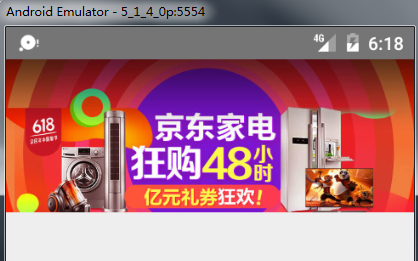
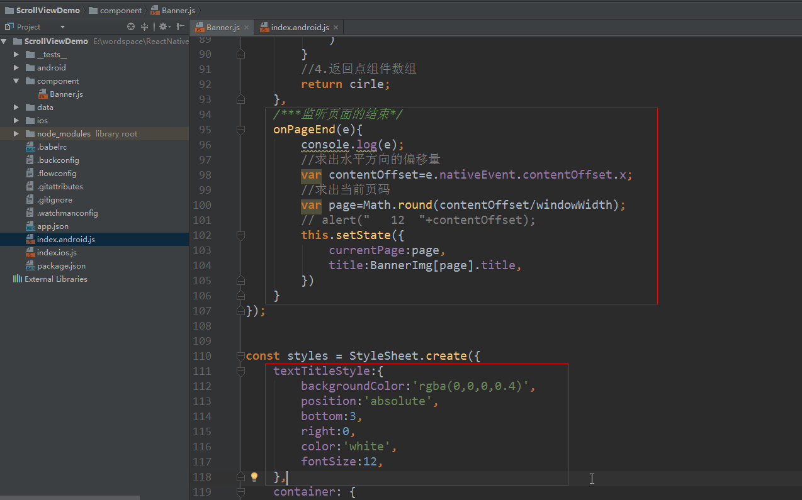
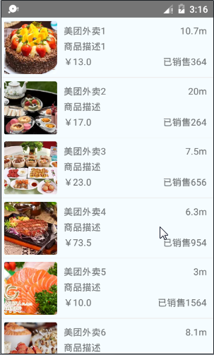
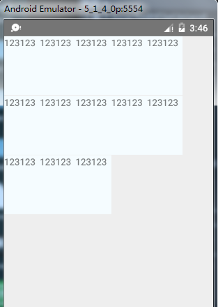

# ReactNative基础进阶

## 1.RN点击事件处理

 在前面的登录界面中，我们发现所有的组件不会对用户的**点击、触摸、拖拽**做出合适的响应，这是十分不友好的。那么，在React Native中如何让视图对触发做出合适的响应呢？

### 1.**高亮触摸：TouchableHighlight**

当手指点击按下的时候，该视图的不透明度会进行降低同时会看到相应的颜色，其实现原理则是在底层新添加了一个View。此外，**TouchableHighlight只能进行一层嵌套，不能多层嵌套**。

 **常用属性：**

> **activeOpacity  number**

设置组件在进行触摸的时候，显示的不透明度(取值在0-1之间)

> **onHideUnderlay**  function  方法

 当底层被隐藏的时候调用

> **onShowUnderlay**  function 方法

 当底层显示的时候调用

> style  

可以设置控件的风格演示，该风格演示可以参考View组件的style

> underlayColor 

 当触摸或者点击控件的时候显示出的颜色

### 2.不透明触摸:  TouchableOpacity

 该组件封装了响应触摸事件；当点击按下的时候，该组件的透明度会降低。

     **常用属性：**

> **activeOpacity  number**  

      设置当用户触摸的时候，组件的透明度


在开发中会经常的用到**点击、按下、抬起、长按**等触发事件，那么在TouchableOpacity中又是改如何展示呢？

演示案例：


## 2.RN组件的生命周期

### **一、看图分析**

对于习惯了iOS和Android开发的同学，可能会对React Native中组件的生命周期很困惑。在iOS中有一个ViewDidLoad来初始化; 在Android中组件的生命周期：Activity，Service, ..，那么在RN中，又是在哪里呢？

  React Native组件的生命周期大致可以划分为**实例化阶段、存在阶段 和 销毁阶段**，其中最常用的为**实例化阶段**，该阶段就是组件的构建、展示时期，需要我们根据几个函数的调用过程，控制好组件的展示和逻辑的处理。


      

### **二、实例化阶段函数功能分析**

> **getDefaultProps**

       该函数**用于初始化一些默认的属性**，通常会将固定的内容放在这个函数 中进行初始化和赋值；

        在组件中，可以利用this.props获取在这里初始化它的属性，由于组件初始化后，再次使用该组件不会调用getDefaultProps函数，所以组件自己不可以自己修改props（即：**props可认为是只读的**），只可由其他组件调用它时在外部修改。

案例：


> **getInitialState**

        该函数是**用于对组件的一些状态进行初始化**；

       由于该函数不同于getDefaultProps，在以后的过程中，会再次调用，所以可以将控制控件的状态的一些变量放在这里初始化，如控件上显示的文字，可以通过this.state来获取值，通过this.setState来修改state值， 比如：

```
this.setState({
    age: 20, 
});
```

       **注意：一旦调用了this.setState方法，组件一定会调用render方法，对组件进行再次的渲染，不过，如果React框架会自动根据DOM的状态来判断是否需要真正的渲染。**

案例：


> **componentWillMount**

       相当于OC中的ViewWillAppear方法，在组件将要被加载在视图上之前调用，功能相对较少。


> **render**

**render是一个组件中必须有的方法，本质上是一个函数，并返回JSX或其他组件来构成DOM，和Android的XML布局类似，注意：**只能返回一个顶级元素 ;

       此外，在render函数中，只可通过this.state和this.props来访问在之前函数中初始化的数据值 。


> **componentDidMount**

在调用了render方法后，组件加载成功并被成功渲染出来以后，所要执行的后续操作，**一般会在这个函数中处理网络请求**等加载数据的操作；

因为UI已经成功被渲染出来， 所以放在这个函数里进行请求操作，不会出现UI上的错误。

      下图是利用了fetch API来异步请求Web API来加载数据：


### **三、存在期阶段函数功能分析**

> **componentWillReceiveProps**  

指父元素对组件的props或state进行了修改

> shouldComponentUpdate  

一般用于优化，可以返回false或true来控制是否进行渲染

> **componentWillUpdate**

组件刷新前调用，类似componentWillMount

> **componentDidUpdate**

更新后的hook

### **四、销毁期阶段函数功能分析**

       用于清理一些无用的内容，如：点击事件Listener，只有一个过程：**componentWillUnmount**

### **五、常用知识点分析**

**5.1  this.state**

        开发中组件免不了要与用户互动，React 的一大创新，就是**将组件看成是一个状态机**，一开始有一个初始状态，然后用户互动，导致状态变化，从而触发重新渲染 UI。

       举个例子：


       当用户点击组件，导致状态变化，**this.setState** 方法就修改状态值，每次修改以后，自动调用 **this.render** 方法，再次渲染组件。

      可以把组件看成一个“状态机”. 根据不同的status有不同的UI展示。只要使用setState改变状态值，根据diff算法算出来有差以后，就会执行ReactDom的render方法，重新渲染页面。

       注意：由于 this.props 和 this.state 都用于描述组件的特性，可能会产生混淆。一个简单的区分方法是，this.props 表示那些一旦定义，就不再改变的特性，而 this.state 是会随着用户互动而产生变化的特性。

**5.2  获取真实的DOM节点**

  在React Native中，**组件并不是真实的 DOM 节点**，而是存在于内存之中的一种数据结构，叫做虚拟 DOM （virtual DOM）。

      只有当它插入文档以后，才会变成真实的 DOM 。

      根据 React 的设计，所有的 DOM 变动，都先在虚拟 DOM 上发生，然后再将实际发生变动的部分，反映在真实 DOM上，**这种算法叫做 DOM diff**，它可以极大提高网页的性能表现。

     但是，有时需要从组件获取真实 DOM 的节点，这时就要用到 **ref 属性**;

     下图通过一个案例来演示：


     

运行结果如下：


       上面代码中，组件 View 的子节点有一个文本组件，如果现在js代码中中获取该组件的文本。这时就必须获取真实的 DOM 节点，虚拟 DOM 是拿不到文本值的。为了做到这一点，文本组件必须有一个 ref属性，然后 **this.refs.[refName]** 就会返回这个真实的 DOM 节点。

      需要注意的是，由于 this.refs.[refName] 属性获取的是真实 DOM ，所以必须等到虚拟 DOM 插入文档以后，才能使用这个属性，否则会报错。上面代码中，通过为组件指定 Click 事件的回调函数，确保了只有等到真实 DOM 发生 Click 事件之后，才会读取 this.refs.[refName] 属性。

### **六、ES5和ES6的差异化**

http://blog.csdn.net/wangzengdi/article/details/50719395

       es5，es6 都是对 ecmascript规范的补充，es5已经大规模使用了，es6目前可能在个别平台存在浏览器兼容性问题； 其中箭头函数()=>()是ES6独有的。

#### **区别1：创建组件**

       组件是一个自定义的js对象，在es5中使用React.createClass()；在es6中必须继承React.component，然后进行创建。

**ES5的写法：**

****

**ES6的写法：**


#### **区别2：组件的属性props**

在ES6中，其为属性：defaultProps(可以标识static定义在class内，也可以定义在class外)，而在ES5中，其为方法：getDefaultProps: function(){return {name:value}};

**ES5:**


**ES6:**


或者

```
export default class ShopPage extends Component {
    static defaultProps = {
        name: 'xiaomage',
        year: 2015,
    }; 
 
    render (){
        return (
            <View />
        );
    },
});
```

#### **区别3：组件的状态state**

**ES5:**


**ES6:**


或者：

```
export default class ShopPage extends Component {

    state = {
        url: 'http://i.meituan.com/topic/scene/1?cevent=imt%2Fhomepage%2Fhomeguide4',
        name:'xiaomage'
    };
   render() {
        return (
            <View />
        );
    },
    
}
```


#### **区别4：组件的导入和导出**

导入


导出：


## 3.RN之ScrollView组件

#### **一、前言**

      一个包装了平台的ScrollView（**滚动视图**）的组件，同时还集成了触摸锁定的“响应者”系统。

**记住ScrollView必须有一个确定的高度才能正常工作**，因为它实际上所做的就是将一系列不确定高度的子组件装进一个确定高度的容器（通过滚动操作）。要给一个ScrollView确定一个高度的话，要么直接给它设置高度（不建议），要么确定所有的父容器都已经绑定了高度。在视图栈的任意一个位置忘记使用`{flex:1}`都会导致错误，你可以使用元素查看器来查找问题的原因。

**ScrollView内部的其他响应者尚无法阻止ScrollView本身成为响应者**。

#### **二、ScrollView中常用的属性**

**注意：ScrollView是继承自View，所以View中所有的属性同样适用于ScrollView。**

http://reactnative.cn/docs/0.44/scrollview.html#content


#### **三：案例效果：**


准备本地数据


导入图片和组件


布局：


样式：


## 4.广告轮播图案例

**用scrollView实现轮播图效果**

### 1.准备数据


### 2.定义一个Banner组件


```
/**
 * Created by Administrator on 2017/6/9 0009.
 */
import React, { Component } from 'react';
import {
    AppRegistry,
    StyleSheet,
    Text,
    View,
    ScrollView,
    Image,
} from 'react-native';
//引入本地数据
var BannerImg=require('../data/banner.json');
var Dimensions=require("Dimensions");
var windowWidth=Dimensions.get('window').width;
//ES5 
var Banner =React.createClass({
    //设计默认值
    getDefaultProps(){
        return{
        }
    },
    //状态机
    getInitialState(){
        return{
        }
    },
    //组件渲染之前调用
    componentWillMount(){

    },
    //渲染组件
    render() {
        return (
            <View style={styles.container}>
                <ScrollView
                    horizontal={true}
                    showsHorizontalScrollIndicator={false}
                    pagingEnabled={true}
                   
                >
                    {this.renderItems()}
                </ScrollView>

            </View>
        );
    },
    //组件渲染之后调用，一般在这里执行耗时操作（网路请求）
    componentDidMount() {
    },

    /**渲染每一个Item*/
    renderItems(){
        //1.定义组件数组
        var Items=[];
        //2.遍历
        for(var i=0;i<BannerImg.length;i++){
            //3.拿到每一张图片名
            var img=BannerImg[i];
            //4.创建并添加组件
            Items.push(
                <Image key={i} source={{uri:img.icon}} style={styles.image1Style}></Image>
            )
        }
        //返回组件
        return Items;
    },

});


const styles = StyleSheet.create({
    container: {
        backgroundColor: '#F5FCFF',
        width:windowWidth,
    },
    image1Style:{
        height:120,
        width:windowWidth,
    },

});
//声明导出组件
module.exports=Banner;
```

### 3.应用组件


效果：




### 4.添加指示器（圆点）


var styleBg=this.state.currentPage==i ? 'orange' : ' white' ; 


添加样式：


效果图：


### 5.添加页面滑动的监听和右边显示的文字

```
//监听页面滑动结束
onMomentumScrollEnd={ (e)=>this.onPageEnd(e)  }
```


**监听页面滑动结束   和    设计样式：**

根据上下文求出偏移量:

```
//获取页面超出左边屏幕的距离
var contentOffSet=e.nativeEvent.contentOffset.x
var page=contentOffSet/windowWidth; 
```



### 6.添加定时器

**1）需要导入计时器类库**

https://github.com/reactjs/react-timer-mixin

```
npm  i  react-timer-mixin  --save     
```

  

开始定时器


**定时切换页面：**

**在上下文中拿到组件需要给组件绑定ref**


**让scrollView根据偏移量进行滚动**

```
//计算出scrollview应该滑动的距离
var currentX = currentPage * screenWidth;
//让scrollView进行滑动
scrollView.scrollResponderScrollTo({x:currentX, y:0, animated:true});
```


**执行效果：**


## 5.RN之ListView组件

**一、前言**

ListView - 一个核心组件，用于高效地显示一个可以垂直滚动的变化的数据列表。最基本的使用方式就是创建一个`ListView.DataSource`数据源，然后给它传递一个普通的数据数组，再使用数据源来实例化一个`ListView`组件，并且定义它的`renderRow`回调函数，这个函数会接受数组中的每个数据作为参数，返回一个可渲染的组件（作为listview的每一行）。

**1.1   首先创建一个ListView.DataSource**数据源，然后给它传递一个普通的数据数组；

**1.2**  **使用数据源(data source)**     实例化一个ListView组件,定义一个**renderRow**回调函数，这个函数会接受数组中的每个数据作为参数，并返回一个可渲染的组件(该就是列表的每一行的item)。

**1.3使用renderRow渲染每一个Item**


**二、ListView常用的属性**

http://reactnative.cn/docs/0.44/listview.html#content

**三、ListView使用案例**

1.定义数据源

```
    getInitialState(){
        var ds=new ListView.DataSource( {rowHasChanged: (r1,r2)=> r1!==r2} );
        return{
            dataSource:ds.cloneWithRows(GoodsData.goods),
        }
    },
```

2.绑定数据源

```
       <ListView
                dataSource={this.state.dataSource}
   
      </ListView>
```


3.Item的渲染

```
         <ListView
                ....
                renderRow={  (rowData)=>this.renderItems(rowData)  }>
        </ListView>
```


## 6.商品表的案例

### 1.准备图片和数据源


### 2.自定义列表组件

```
var ds=new ListView.DataSource( {rowHasChanged: (r1,r2)=> r1!==r2} );
```


### 3.引用列表组件


执行效果：


### 4.完善Item布局


### 5.Item的样式


### 6.执行效果




## 7.九宫格案例-(网路请求)

### 1.准备数据


### 2.自定义组件

```
//该属性是修改ListView内容显示的样式，下面的样式可以使ListView变成GridView的展示方式
contentContainerStyle={{flexDirection:'row',flexWrap:'wrap'}}
```


### 3.引用组件


执行效果：



### 4.完善Item布局


### 5.Item的样式


执行的效果：


### 6.访问网络

1.定义一个属性url

```
http://47.93.30.78:8080/MeiTuan/category
```

2.定义空的数据源


3.发起网络请求，并更新数据源


执行的效果：


### 7.指定请求方法和添加请求参数


